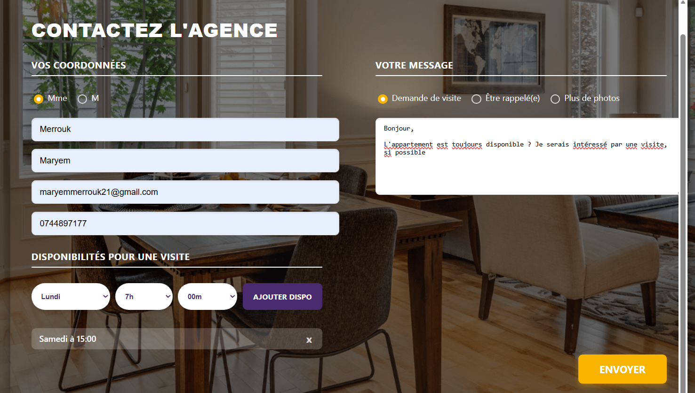

# Test Tremplin - Maryem MERROUK

## Présentation
- Nom & Prénom : Maryem MERROUK
- Niveau : Master 2 informatique - Ingénierie du Web, des Objets Communicants et des Systèmes complexes (IWOCS)
- Durée stage recherchée : 6 mois
- Date du début souhaité : mars 2026

## Stack utilisée
- Frontend: React avec Vite (TypeScript pour le développement)
- Backend: PHP 8.3 (Apache) et accès à la base de données avec PDO
- DB: MySQL 8.0
- Containerisation: Docker Compose (Apache / MySQL / phpMyAdmin)
## Aperçu du formulaire
Voici un aperçu de la page du formulaire de contact : 

## Pour lancer le projet
1. Cloner le projet
2. `docker compose up -d`
3. Dans un autre terminal:
   cd front-tremplin-app
   npm install
   npm run dev

## Retour d'expérience sur l'exercice
1. Avez-vous trouvé l'exercice facile ou vous a-t-il posé des difficultés ? Si oui, lesquelles ?
Non, l'exercice était globalement fluide.

2. Nouveaux Outils Appris :
Non, je n'ai pas eu besoin d'apprendre de nouveaux outils spécifiquement pour cet exercice. J'ai utilisé des outils avec lesquels je suis déjà familière.

3. J'ai choisi ces outils car ils constituent ma stack Full Stack :

- React/Vite : Pour la vitesse de développement, la performance front-end, et l'utilisation de composants réutilisables.

- PHP : Pour sa simplicité et sa robustesse en tant que langage de scripting backend pour la logique simple du formulaire.

4. Utilisation de la Stack Proposée et de Docker
- Stack Proposée : Oui, j'ai utilisé la stack demandée (React, PHP, MySQL).

- Utilisation de Docker : Oui, j'utilise régulièrement Docker pour la plupart mes projets universitaires. Il est indispensable pour isoler les environnements, garantir la cohérence des versions logicielles et faciliter le déploiement.